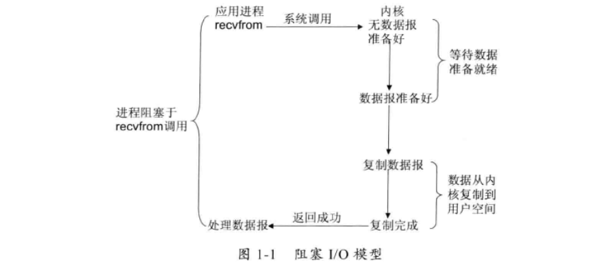
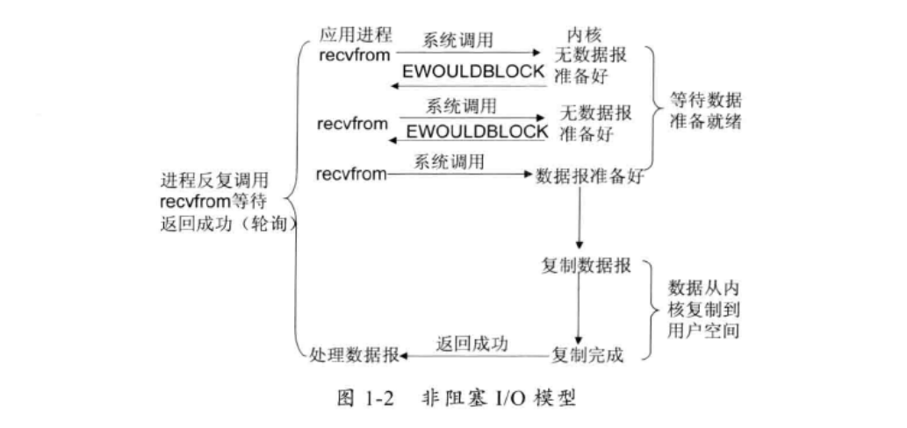
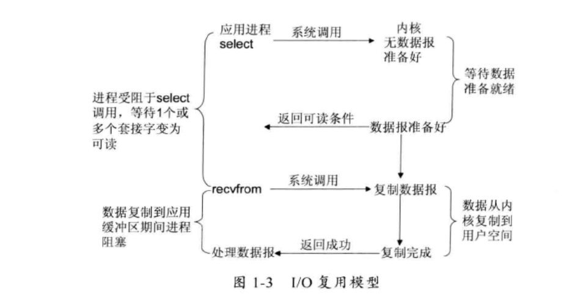
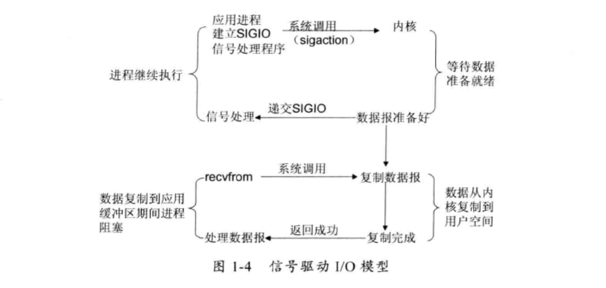
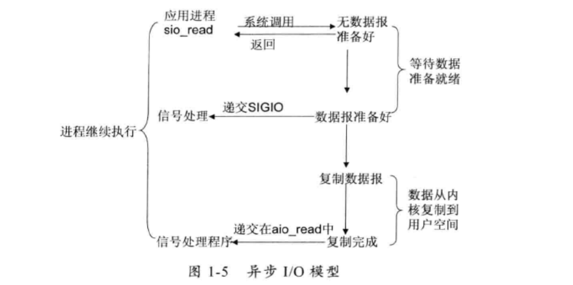

根据UNIX网络编程对IO的分类

1、阻塞I/O模型:最常见的IO模型，默认情况下，文件操作都是阻塞的，意味你读文件的时候必须读完或者逻辑处理完成后才能进行下一步，读进程在这一段时间都是被阻塞的。过程如同1-1

2、非阻塞IO模型:数据从应用层到内核时，如果缓冲区没有数据，就会返回一个错误，但是会一直对IO模型进行轮询检查这个内核有没有数据到来。如图1-2

3、IO复用模型:Linux提供select/poll，进程将一或多个文件（fd）传给select/poll调用，阻塞也只会阻塞给select操作上，根据fd是否就绪来执行相应的执行操作，也叫事件驱动。俗称在原有IO模型再加个中间层，这样性能更高

4、信号驱动IO模型:用套接字信号IO功能，当数据就绪，为该进程生产一个SIGIO信号，通过信号回调应用程序来读取数据

5、异步IO：内核开始某操作，让内核在操作完成后通知我们，这个模型和信号驱动主要区别是信号IO让内核通知我们什么时候开始IO，异步IO是由内核通知我们什么时候IO操作已经完成。

借鉴书籍：Netty权威指南

想要了解更多 可以阅读《UNIX网络编程》