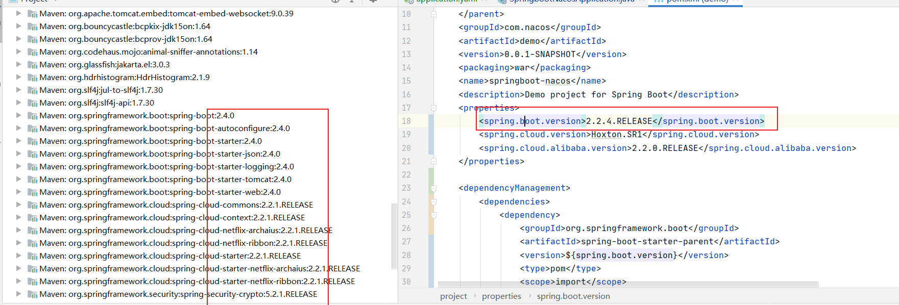
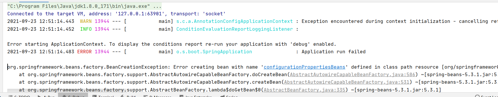

1、首先配置文件一定要对应上

2、SpringCloud版本一定要配合上，不然真的报错太多

版本对应官方链接

https://hub.fastgit.org/alibaba/spring-cloud-alibaba/wiki/%E7%89%88%E6%9C%AC%E8%AF%B4%E6%98%8E

https://spring.io/projects/spring-boot#learn